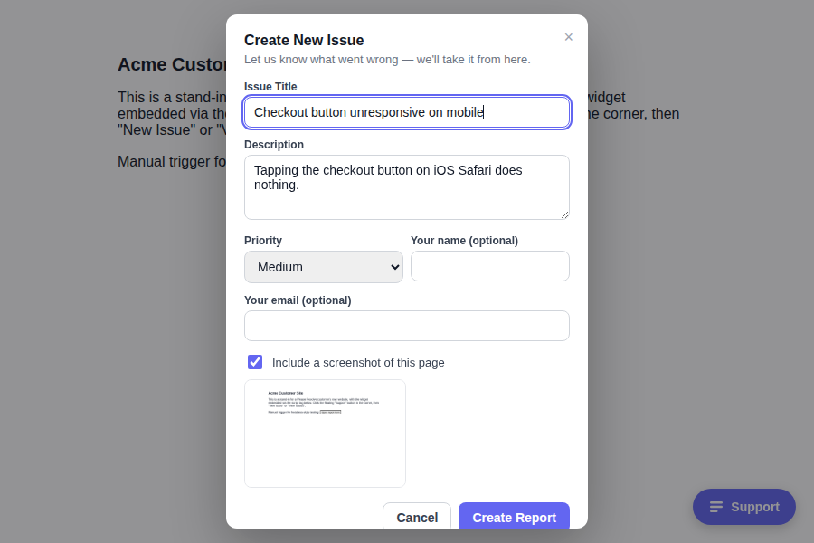

# @pleaseresolve/sdk

[](https://www.npmjs.com/package/@pleaseresolve/sdk)
[](https://www.npmjs.com/package/@pleaseresolve/sdk)
[](https://bundlephobia.com/package/@pleaseresolve/sdk)
[](./LICENSE)

**Drop-in issue reporting for any website.** Paste one script tag or `npm install` one package,
and your visitors can report a bug — with a screenshot, browser context, and priority — straight
into your [Please Resolve](https://pleaseresolve.nukta.solutions) dashboard. No backend code, no
account required on the visitor's side.

```html
<script src="https://cdn.pleaseresolve.app/widget.js" data-key="pk_live_..." data-project="..."></script>
```



## Contents

- [Features](#features)
- [Install](#install)
  - [Script tag](#script-tag)
  - [npm, zero config](#npm-zero-config)
  - [npm, explicit config](#npm-explicit-config)
- [How it works](#how-it-works)
- [API reference](#api-reference)
- [Screenshot capture](#screenshot-capture)
- [Security model](#security-model)
- [Development](#development)

## Features

- **Zero-friction reporting** — a floating Support button, a short form, done. No account, no
  login, no app to install.
- **Two ways to see it live**: a self-updating **script tag** for any site, or this **npm
  package** for a bundled app — same widget either way.
- **Zero-config npm install** — set two env vars, `import "@pleaseresolve/sdk/auto"`, and the
  widget mounts itself. No `init()` call required in your code.
- **Consent-gated screenshot capture** — the reporter always sees a live preview and a checkbox
  before a screenshot is sent, never silently.
- **"View Issues"** — reporters can check the status of what they've already submitted, without an
  account, scoped to just what that browser reported.
- **~12KB minified** for the script-tag build — screenshot capture is lazy-loaded on demand, never
  paid for on a page load that never uses it.
- **First-class TypeScript** — types ship from the same source as the runtime code.
- **[React bindings](https://github.com/Nukta-Solutions/pleaseresolve-sdk-react)** available as a
  separate `@pleaseresolve/react` package.

## Install

Get a `public`-type API key first: Settings → API Keys → Create API Key in your Please Resolve
dashboard, `keyType: public`, with the site(s) you're embedding on listed in `allowedOrigins`. A
`public` key is locked server-side to creating reports only — it's meant to be embedded in a page
anyone can view; see [Security model](#security-model).

### Script tag

```html
<script
  src="https://cdn.pleaseresolve.app/widget.js"
  data-key="pk_live_..."
  data-project="..."
></script>
```

Paste before `</body>`. `data-project` can be omitted if the key is scoped to exactly one project.
Full reference: [Phase 2 guide](docs/PHASE_2_SCRIPT_TAG_GUIDE.md).

### npm, zero config

```sh
npm install @pleaseresolve/sdk
```

```sh
# .env
NEXT_PUBLIC_PLEASERESOLVE_KEY=pk_live_...
NEXT_PUBLIC_PLEASERESOLVE_PROJECT_ID=...   # optional — only if your key covers more than one project
```

```ts
// anywhere in your app's entry point
import "@pleaseresolve/sdk/auto";
```

That's the whole integration. The widget reads those env vars at *your app's own build time* and
mounts itself — no `init()` call anywhere in your code. This works because a real bundler
(Next.js, Create React App) is what inlines `NEXT_PUBLIC_...`/`REACT_APP_...` env vars into the
bundle; see [`src/env.ts`](src/env.ts) for exactly which prefixes are supported and why. Using
React? [`@pleaseresolve/react`](https://github.com/Nukta-Solutions/pleaseresolve-sdk-react)'s
`<ReportWidget />` reads the same env vars with zero props.

### npm, explicit config

Prefer to call `init()` yourself — explicit values, conditional mounting, a config source other
than env vars? Skip `@pleaseresolve/sdk/auto` and use the [API reference](#api-reference) below
instead. The two approaches aren't meant to be combined.

## How it works

Clicking the floating **Support** button opens a small menu:

- **New Issue** — a short form (what happened, details, priority, optional name/email, and a
  screenshot preview you can include or drop) that submits straight to your dashboard.
- **View Issues** — a popup listing what *this browser* has already reported, with a live-fetched
  status for each. There's no login and no way to see anyone else's reports.

Every submission also auto-attaches context (current URL, browser, viewport) with zero
configuration.

## API reference

```ts
import { init, open, close, report, identify, setMetadata, destroy } from "@pleaseresolve/sdk";
// or, from the script tag: window.PleaseResolve.init(...)

init({ key: "pk_live_...", projectId: "...", widget: true });

// Headless mode — drive it from your own trigger button:
init({ key: "pk_live_...", widget: false });
myOwnButton.addEventListener("click", () => open());

// Skip the UI entirely:
await report({ title: "...", description: "...", priority: "high" });

// Pre-fill identity on every subsequent report:
identify({ name: "...", email: "..." });
setMetadata({ plan: "pro" });

// Tear down (React's <ReportWidget /> calls this on unmount):
destroy();
```

| Function | What it does |
|---|---|
| `init(options)` | Mounts the widget. `key` is required; `projectId`, `apiBaseUrl`, `widget`, `screenshot` are optional. |
| `open()` / `close()` | Opens/closes the built-in form — for a custom trigger button (`widget: false`). |
| `report(input)` | Submits directly, no UI. Never auto-attaches a screenshot (only the form does — see below). |
| `identify(reporter)` | Pre-fills the form's name/email and attaches that identity to every later `report()`. |
| `setMetadata(obj)` | Merged into every report's `metadata` from this point on. |
| `destroy()` | Unmounts the widget and clears all state. |

"View Issues" is backed by `GET /api/v1/public/reports/:id` — the *only* read this SDK ever
performs. There's no "list all reports" endpoint; the widget only ever looks up ids it tracked
itself in `localStorage`. That endpoint returns a minimal summary (title/status/priority/date)
only, never description, attachments, or comments.

## Screenshot capture

On by default (`init({ screenshot: true })`). The built-in form captures a screenshot the moment
it opens and shows a live preview with a checkbox to include or drop it — **the reporter always
sees it before anything is sent.** That's why it's wired up for the form only; headless `report()`
calls never capture one.

The capture library (`html2canvas`, ~200KB) is **not bundled** — it's fetched from a CDN the first
time a screenshot is actually taken, so a page that never opens the form pays nothing extra. This
is what keeps the script-tag build at ~12KB minified.

## Security model

Two API key types exist for a reason:

| | `public` | `server` |
|---|---|---|
| Where it's used | Script tag, npm bundle — anyone can read it from the page | Your own backend, CI, webhooks |
| Permissions | `report:create` + `report:read` only, forced server-side | Whatever you grant it |
| Origin check | Restricted to `allowedOrigins` you configure | None — no browser involved |

**Never put a `server`-type key in a web page.** It's not restricted the way a `public` key is.
See the [Phase 1 API guide](https://github.com/Nukta-Solutions/pleaseresolve-backend/blob/saikat/docs/PHASE_1_PUBLIC_API_GUIDE.md#security)
for the full rationale.

## Development

```sh
npm install
npm run build      # dist/sdk.{js,cjs,d.ts}, dist/auto.{js,cjs}, dist/widget.global.js
npm run typecheck
```

Two live end-to-end test suites (no mocking — a real local backend, real S3 uploads, real headless
Chrome):

```sh
node test-e2e.mjs        # the full widget UI: menu, form, screenshot capture, View Issues
node test-auto-init.mjs  # @pleaseresolve/sdk/auto specifically — bundles a throwaway app with
                          # esbuild --define (the same substitution Next.js/CRA perform) and
                          # confirms it mounts and submits with zero init() calls anywhere
```

Both require a local `pleaseresolve-backend` running on `:5000` (`docker compose up` there).
`demo/index.html` is also the manual/visual demo — open it after substituting real
`data-key`/`data-project` values.

See the sibling [`pleaseresolve-sdk-react`](https://github.com/Nukta-Solutions/pleaseresolve-sdk-react)
repo for React bindings, and [`GOING_LIVE.md`](../GOING_LIVE.md) in this workspace for the
CDN-hosting and npm-publishing runbook.

## License

MIT
